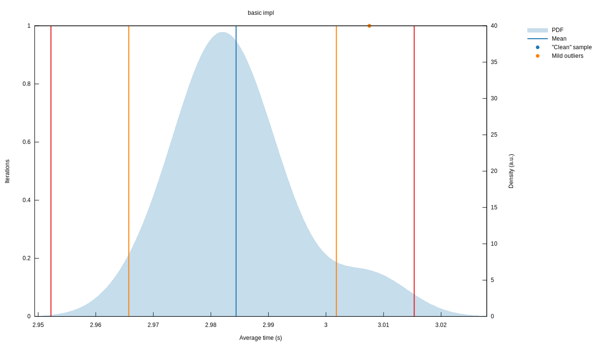
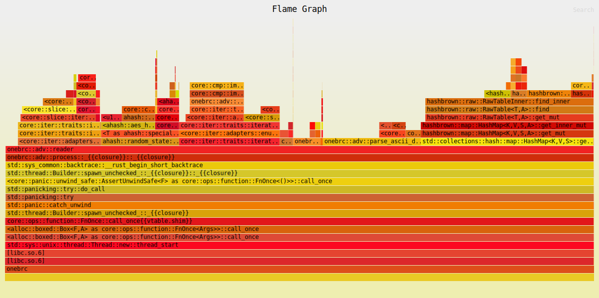

# 1BRC in Rust 1️⃣🐝🏎️ 🦀
[1brc challenge](https://github.com/gunnarmorling/1brc/) but in RUST.

## Benchmark result
WSL2, Ryzen 5600, 16 GB DDR4, 1TB SDD PCI3.0

| min      | mean     | max      |
|----------|----------|----------|
| 2.9636 s | 2.9747 s | 2.9818 s |

## FlameGraph
